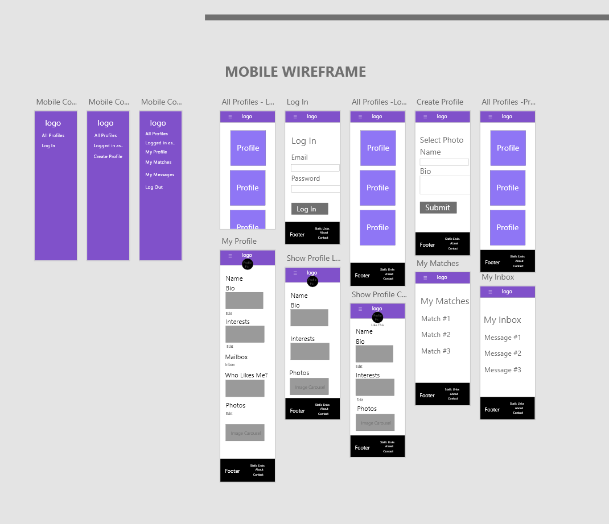

#### A link (URL) to your published App:
https://radiant-mesa-98613.herokuapp.com/

#### A link to your GitHub repository
https://github.com/gjohn34/Rails-Assessment

#### Problem definition / purpose
See Questions 1-3

#### Functionality / features
Our application offers the following features:
```
User authentication
Users being able to create and edit their profiles to their unique tastes regarding interests, photos, self-bio and many more that are planned in the future builds
View other profiles
Like other profile and be liked back
Message other profiles
See Messages that have been sent to them
Matching with other Profiles
The 'opportunity' to give up the dosh to become a premium user
Viewable on different screen sizes with responsive designs
Searching for other users based on their interests. Future builds plan to elaborate on search functions by name, age location etc
Future Build to incorporate administrative users that can edit or remove profiles based on other User reports
```
#### Screenshots


#### Tech stack (e.g. html, css, deployment platform, etc)
Our application will be built using Ruby on Rails, deployed on Heroku

#### Instructions on how to setup, configure and use your App.
Application is live on Heroku. No configuration from users necessary.

#### Design process
See questions relating to Design Process

#### User stories
See question requesting User Stories

#### A workflow diagram of the user journey/s.


#### Wireframes
See question requesting Wire Frames

#### Database Entity Relationship Diagrams


#### Project plan & timeline
Day 1 - Group Makeup
Day 2 - Planning:
	Working on initial project ideas and layout of the application
Day 3 - Database Desigin:
	Development of the database relationships and how each would be implemented in rails
Day 4 - Initial Work:
	Initial structure of the application, including links around static pages, creating profile database and creating create/edit/show profile
Day 5 - Seeds and weeds:
	Seeding database with existing profiles, creating interests available for each profile to have which would become a searchable feature between profiles
Day 6 - Likes:
	Giving profiles the ability to like other profiles, when two profiles like each other they are given a notification in their 'matches' page
Day 7 - Implementing Stripe and Devise:
	Giving Stripe functionality, if a profile isn't premium and and tries to make a date with another profile they are taken to the stripe page to give up their credit card details and premium status is applied. Devise implemented for users to log in.
Day 8+ - Bug fixing

#### Screenshots of Trello board(s)


See question requesting Trello Board


# 1. What is the need (i.e. challenge) that you will be addressing in your project
In the current dating marketplace, many people are turning to online dating to satisfy their social needs. We will be addressing this need by creating a simple and user-friendly application to enable users to find, create and build on potential relations with other users.
# 2.Identify the problem you’re trying to solve by building this particular marketplace App? Why is it a problem that needs solving?
Big problem with Dating and Meetup Sites is that laboring through millions of profiles can be time consuming and lack luster when all these people aren’t interested in the same things you are. Wouldn’t it be great if you could find people by searching for their interests and other things that are important to you.
# 3.Describe the project will you be conducting and how your App will address the needs.
Our project will be a dating/meet up application that will match users based on their interests that users can view and explore. We will be implementing features in the future that will allow users to search by locations, sex, age range and any other necessary parameters.
# 4. Describe the network infrastructure the App may be based on.
In order for Heroku, our hosting provider, to manage the millions of concurrently running applications on platform it is broken up into several segments; the most important of these segments is the Routers and the Dynos.
When an application is deployed to Heroku, that application's code is run on a virtual machine called a 'dyno', the more dynos an applicatino has the more intsances of that application are available for the Routers to make requests. ie a high volume application would require more dynos so as to not create hangs on requests. Each one of these dynos are isolated from each other to prevent one fault to cascade to others, and represents 512MB of physical RAM.
Once the application is up and running, it is credited 750 dyno/hours per month which is the amount of 'free time' available for a user's application to handle requests, applications with a single dyno only is idled until use so as to allocate these dynos to other applications. After an application has been allocated a dyno it is capable to recieve requests from the Heroku Router.
When a user visits the application via Heroku's platform urls .herokuapp.com or heroku.com the Router will recognize the dynos associated with your application, sends the user request to the dyno and awaits a response.

# 5. Identify and describe the software to be used in your App.
Git and Github for version control:
Git is a version control system for tracking changes in files and coordinating work on 	those files. Github is an online hosting service for version control using git.
Heroku for hosting:
Heroku is a cloud platform as a service supporting serveral programming languages. 	Heroku allows you to host your application on their private servers instead of users 	having to create and configure their own.
Code written in Ruby on Rails:
Ruby is an object-oriented general purpose programming language with a focus on third 	party ‘gems’ that incorporate added features that aren’t included in the base language.
Rails is one of these gems that is a server-side web framework. Rails is a 	model-view-controller framework that allows programmers to create online applications
	written in the Ruby language.
Materialize for design:
 Materialize is a gem that provides styling options for developers so less time is spent 	styling and more time focusing on the logic of an application. Users have the option of 	specializing the layout by changing layout class names to the ones provided by 	Materialize.
SimpleForm for Simple Forms:
Simple form is a gem that takes the default form logic provided by Rails and simplifies it 	into chunks so there is less duplication when writing inputs and labels. My technical 	knowledge of SimpleForm isn’t 100% so default Rails Form tags were used in place for a 	majority of the form inputs.
Cloudinary for image hosting via ActiveStorage:
ActiveStorage is a rails default system of saving images/vidoes uploaded by users or 		generated by the system that are saved within Rails and compressed as slugs of 	metadata that can be recalled back onto the view. In our application, our ActiveStorage 	data is stored remotely within Cloudinary’s servers.
Cloudinary is an online image and video management service, they act as a storage and 	transformation host for developers instead of each user hosting locally.
ImageMagick for image processing:
ImageMagick is a free and open-source software suite for displaying, converting and 	editing image files. Cloudinary has their own transformation tools but while this project 	was in development and testing ImageMagick was used locally.
FriendlyIds for more user friendly urls:
FriendlyId is a gem that takes a Model’s Id and creates a slug based on another field of 	data then incorporates that slug into the url instead of the number Id. Ie 	profiles/1/phots becomes0 profiles/john-smith/photos.

# 6. Identify the database to be used in your App and provide a justification for your choice.
For this application, we have chosen to use PostgreSQL for our database management.
### The reasons for this are that PostgreSQL:
```
Is free and open source
Wide documentation available for support
Over 30 years of continous improvements
Runs on all major operating systems
ACID-compliant and coforms to 160/179 of the mandatory features
Many powerful addons and extensions for more control over a project.
Heroku Postgres  cloud-hosting with extra features like data clips, snapshots, etc.
Uses Parallel Execution of SQL statements for a faster delivery
```

### Con - Memory Intensive - not a problem as we won't have many connections
```
Installation and configuration - not a problem w/ heroku
Feature heavy, a lot to learn
```

# 7. Identify and describe the production database setup (i.e. postgres instance).
The production database will be set up as a Postgres instance hosted by Heroku which can be accessed by any language with a PostgreSQL driver. In order to take advantage of this database in rails, we are required to include the ‘pg’ gem in our gemfile.
When the application is deployed to Heroku, a database.yml file is automatically created which configures ActiveRecord to include the necessary fields to connect to the Heroku Postgres Server
# 8. Describe the architecture of your App.
As this application is build in Ruby on Rails, the application follows an MVC architecture. To maintain a separation of concerns, our code and logic is encapsulated into separate and isolated segments.
When a user visits a static page on our website, a GET request is made to our Router, this router will send that request to the appropriate controller and that controller will render the appropriate view for the site user. When a query to the database is made, eg loading a profile's picture the controller will make a request to the model that holds the information and the model makes that information available on the view to render for the user.
# 9. Explain the different high-level components (abstractions) in your App.
See questions 9, 10, & 22.
# 10. Detail any third party services that your App will use.
This application relies on a number of third party services to function correctly. A number of these services are ruby gems, these services are:
Materialize - This gem is responsible for compiling the Material Design language by Google to be available in the HTML & CSS, the purpose of this service is to allow for a more familiar user experience across different applications.
Simple Form - Simple form aims to create powerful form components while writing less code by being a layer on top of the HTML that we can call on instead of writing a full form layout.
FriendlyIds - Friendly Ids creates pretty URLs and wok with h	uman-firendly strings instead of numeric ids. Works with Active Record to integrate these strings in place of ids to make friendlyids match a value provided to them.
Dotenv - As the repository of this application will be published online, Dotenv is required to keep our sensitive passwords separate from the code
Active Storage and Cloudinary- As our application will be recieving user attachments from uploads we will be using Active Storage to save slugs of attachements and Cloudinary to host these images on a 3rd party server
GitHub - For version control, we have used Git and GitHub to safely and remotely store our data between sessions.
Heroku - Our application will be using Heroku servers to host.
Stripe - Stripe is a third party platform that takes the responsibility of credit card payments away from the host. This includes holding all user data on their own private servers with their own security.

# 11.Describe (in general terms) the data structure of marketplace apps that are similar to your own (e.g. eBay, Airbnb).

Above is a RDS example of the popular tinder app, that matches other users based on their gender, location distance, age range. When a tinder account is created, users can choose to authenticate via their Facebook profile or Instagram profile.
Each account has many likes and super likes (paid content) that is a listing of profiles that are liked or actively not-liked by this user.
After two users are matched together then they can message between each other until one of the users unmatch from the other.

# 12. Discuss the database relations to be implemented.
In our application, our database relationships are as follows:
Each User will have 1 and only 1 Profile and each Profile can have 1 to Many attachments defaulting to a system generated image if one isn’t chosen.
When two profiles message each other, a Conversations table of the two profiles is created and each message sent between these two Profiles belongs to this Conversation between two Profiles so each Profile can have many Conversations (with different Profiles) and each conversation can have many Messages.
When a user edits their profile, they have the option of adding interests to their profile and this is a feature that can be searched for in the future. In order to have profiles searchable based on interests, the database is set up in a way each profile can have many interest and each interest can belong to many profiles.
When a profile ‘likes’ another profile then that profile is added to the current users list of ‘liked’ profiles. The way this is set up in the database is that each ‘like’ can have many profiles and belong to many profiles.
# 13. Describe your project’s models in terms of the relationships (active record associations) they have with each other.
In regards to the database relations to be implemented above, we will have a number of Models associated with the application.
Firstly, we will have a User Model that will handle the devise authentication and logins. This was chosen to be separate from the Profile Model as it will provide the option for a profile to be created/deleted by an administrator for various reasons such as debugging or catching out naughty users who do the wrong thing. Once a User has created a Profile there will be a one to one relationship sharing a unique ID so that each user can only have one profile at a time. This Profile will have many attachments that can be recalled and viewed on a Profile show.
The Profile model will belong to User, have many Messages as well as having and belong to many Interests and Likes.
On profile creation, each Profile will have the option of adding Interests to their Profile. Each interest has many and belongs to many profiles. This relationship allows an easier search function when searching by interest
In regards to Messages and Conversations, a Conversation Model will have one sender field and receiver field(these names are arbitrary and can be used interchangeably as the code will treat them both as the same when a query is done on each Profile) and many Messages. This functionality wasn’t implemented fully and at the moment there is no Conversations Table, each profile can only see the messages that have been sent to them.
# 14. Provide your database schema design.

# 15. Provide User stories for your App.

# 16. Provide Wireframes for your App.
Link to Desktop Wireframe, am unable to link more than 1 layout.
https://xd.adobe.com/spec/fa614ee9-dd7b-4463-4ec9-cb0a730f9c2d-8c50/

Wireframe for Ipad

Wireframe for Mobile

# 17.Describe the way tasks are allocated and tracked in your project.
See question 18.
# 18.Discuss how Agile methodology is being implemented in your project.
In our project plan, we organized tasks based on individual strengths and delegated small chunks of tasks to be implemented and completed within an appropriate time. Larger features were broken down and implemented in smaller steps.
After working on a task, if the scope or difficulty of the task was greater than initially expected we would review the importance of the feature and decide if we would need to allocate more time to research and implementation or drop the feature for future development. An example of this happening is implementing the Messaging feature between Profiles; setting up the feature and seeing ones own messages was simple enough but breaking up the database to have individual conversations between users was deemed too difficult to implement so the design was changed to drop that individual messaging functionality in lieu of just being able to see your inbox.
# 19.Provide an overview and description of your Source control process.
After creating a new rails project it was pushed to GitHub and shared with the other members of the team. During each feature sprint that each user worked on, a branch was created to work on that feature. After it was deemed complete the branch pulled the master to pull other work from other users and merged with the local master then pushed back up to GitHub if there was no conflicts. As each member was delegated tasks based on their proficiency with certain functions there was no pull request and review from the other team members.
# 20.Provide an overview and description of your Testing process.
In our application, we tried to implement system testing using capybara integration testing eg User ‘clicks’ a certain link that takes them to a certain path then fills out ‘form id’ with certain information then validates the existence of that data, or User logs in with their login details on the browser page and we validate their successful login; unfortunately we had difficulties with dependencies that were no longer supported or unable to be successfully installed without data corruptions.
In place of proper integration system tests we stuck with simple model and controller tests for validation of existing fields and ensuring that defined paths were correct. For the tests that refused to install properly we would have to manually input the data into our forms and manually visit all links to ensure they worked.
In a perfect world, these tests would of functioned properly so we could spend less time testing and more time building.
# 21. Discuss and analyze requirements related to information system security.
See question 22.
# 22. Discuss methods you will use to protect information and data..
To protect user data it is essential that every request is authenticated, the first point of security to look at is sessions. Rather than have users re-enter their details for each request, their username and password are stored in a session hash. 
To avoid session information in cookies being sniffed, forcing SSL on the server ensures that a secure connection is made between the host and user. 
Including a “log out” button ensures the the user has an easy to locate way to end the session and prevent others from using their account.
As Rails includes the authenticity token, submitted forms are validated before database modification can occur. 
We used devise to authenticate users via email and password login. The password is encrypted as an added layer of security.  Profile editing is restricted by comparing the current logged in user id against that of the profile they are viewing. In addition, if the user is not logged in while viewing a profile, uploaded gallery photos are inaccessible.
# 23. Research what your legal obligations are in relation to handling user data.
The internet is still a relatively new technology and we’re still trying to understand the impact it has on society, many of our laws regarding technology haven’t been updated to reflect the advances. User data protection has been a conflicting issue throughout the growth and monetization of the internet, and has resulted in laws created to protect users in various countries. The most notable effort is the GDPR in the EU, which has inevitably had a global impact as it applies to not only EU based companies but those that offer goods and services there - i.e Facebook.
Although there is a Privacy Act in Australia, it doesn’t place as many restrictions on companies as the GDPR. For example, the Privacy Act has a $2.1 million fine for breaching and includes a small business exclusion under certain circumstances, whereas the GDPR fine is €20 million or roughly 4% of their total worldwide annual turnover.
As we aren’t intending to engage with an international user-base, we only need to adhere to the Privacy Act 1988 - while broad it’s somewhat straightforward with what constitutes as “personal information”.
Essentially we need to follow the “information lifecycle”:
1. Consider whether it is actually necessary to collect and hold personal information in order to carry out your functions or activities
2. Plan how personal information will be handled by embedding privacy protections into the design of information handling practices
3. Assess the risks associated with the collection of the personal information due to a new act, practice, change to an existing project or as part of business as usual
4. Take appropriate steps and put into place strategies to protect personal information that you hold
5. Destroy or de-identify the personal information when it is no longer needed.

While we weren’t able to incorporate it in time, there is a Ruby Gem called “GDPR Rails - https://github.com/prey/gdpr_rails” that makes your app GDPR compliant. Although GDPR isn’t applicable to our app, many of the guidelines run parallel with the Australian Privacy Act 1988 albeit stricter with harsher consequences - by complying with the former we should comply with the latter by default. Assuming the functionality is there, including this gem would be a fantastic addition to our existing security measures.
